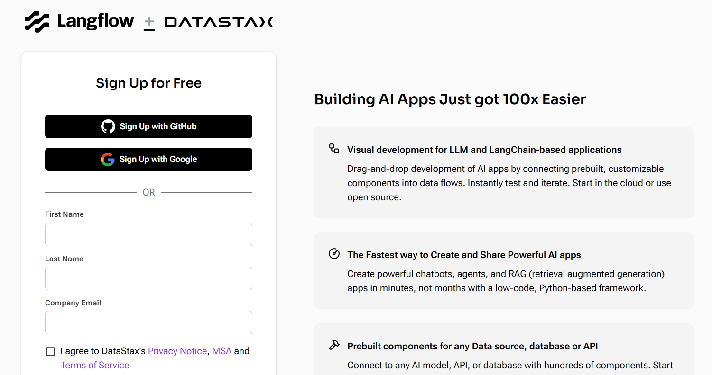
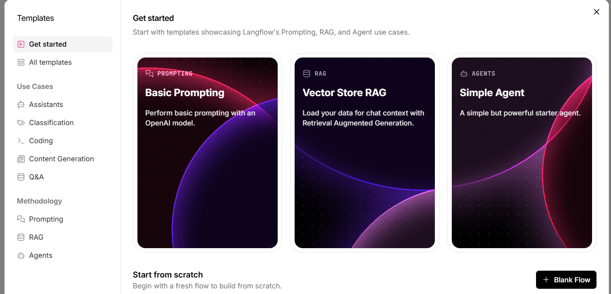

# **Lab: LangFlow**

## **Part 1: Account Setup and Getting Started**

### **Step 1: Access LangFlow**
1. Open your web browser and navigate to [LangFlow](https://www.langflow.org/).
2. Click on the **Sign Up** button in the top-right corner of the homepage.

### **Step 2: Create an Account**
1. Fill in the required details or Signup using other options.
2. Click the **Sign Up** button.

### **Step 3: Verify Your Email (If Required)**
1. Check your inbox for a verification email from LangFlow.
2. Click on the verification link to activate your account.

### **Step 4: Log In**
1. Return to [LangFlow](https://www.langflow.org/) and **Log In**.

---

# **Use Case 1: Health Care Staffing Invoice Generator**

### **Objective**:
Create a flow to:
- Generate invoices for clients.
- Calculate recruiter commissions.
- Summarize placement data.

### **Steps**

#### **Step 1: Create a New Flow**
1. Log in to LangFlow.
2. On the dashboard, click **New Flow**.

3. Now, click **Blank Flow**.

#### **Step 2: Add an Input Node**
1. Drag and drop the **Input** node onto the canvas.
2. Select **Text Input** and configure it to accept:
   - Client name
   - Number of staff placed
   - Total placement cost
3. Optionally, add a **Chat Input** for user-friendly conversational data entry.

#### **Step 3: Add a Calculation Node**
1. Drag the **Calculation** node to the canvas.
2. Connect the Input node to the Calculation node.
3. Configure the calculation for:
   - Recruiter commission (e.g., 10% of placement cost).

#### **Step 4: Add an Invoice Generator Node**
1. Drag the **Output** node onto the canvas.
2. Connect it to the Calculation node.
3. Configure the output to:
   - Generate an invoice PDF.
   - Include client name, placement details, and recruiter commission.

#### **Step 5: Test the Flow**
1. Enter sample data in the Text Input node:
   - Client: `ABC Hospital`
   - Staff placed: `5`
   - Placement cost: `$10,000`
2. Run the flow and review the generated invoice.

---

# **Use Case 2: Canadian Federal Government Document Summarizer**

### **Objective**:
Create a flow to:
- Summarize large government documents.
- Highlight key financial data and action points.

### **Steps**

#### **Step 1: Create a New Flow**
1. Log in to LangFlow.
2. Click **New Flow** on the dashboard.

#### **Step 2: Add a Document Input Node**
1. Drag and drop the **Document Input** node onto the canvas.
2. Configure it to upload:
   - Government policy documents (PDFs or text files).

#### **Step 3: Add a Summarization Node**
1. Drag the **Summarization** node to the canvas.
2. Connect it to the Document Input node.
3. Configure it to:
   - Extract key points.
   - Identify financial metr